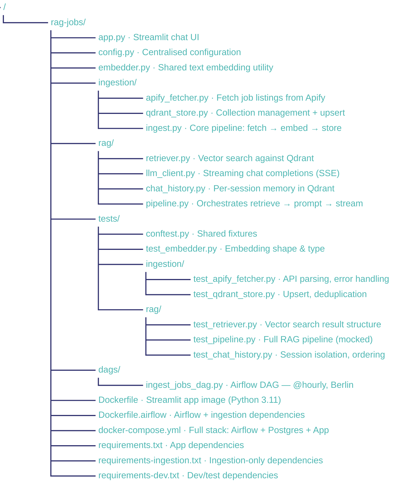
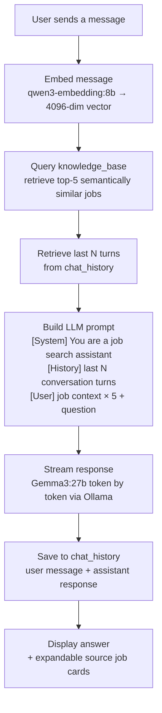

# JobRAG — AI-Powered Job Search Assistant

### End-to-end RAG pipeline for **Software Engineer** jobs in **Berlin, Germany**.  
### Automated hourly ingestion · Vector search · Streaming LLM responses · Fully containerised.


---

## Overview

JobRAG is a production-grade **Retrieval-Augmented Generation (RAG)** system that automatically collects **Software Engineer** job listings from **LinkedIn Berlin** every hour, embeds them into a vector database, and exposes a conversational AI interface for natural-language job market queries.

Three core pillars:
- **Automated data pipeline** — Apache Airflow orchestrates hourly ingestion via the Apify scraping platform
- **Semantic search** — Qdrant Cloud stores 4096-dimensional job embeddings for high-quality vector retrieval
- **Conversational AI** — A streaming LLM (Gemma3:27b via Ollama) generates grounded answers from retrieved job context

---

## Architecture

# Architecture


---

## Features

| Feature | Detail |
|---|---|
| **Automated ingestion** | Airflow DAG runs every hour, fetches 50 fresh listings from LinkedIn Berlin |
| **Deduplication** | Deterministic UUID from `job_id` prevents duplicate entries |
| **Semantic search** | 4096-dim dense vectors, Cosine similarity, top-5 retrieval |
| **Streaming responses** | Token-by-token output via SSE from the LLM API |
| **Conversation memory** | Per-session chat history stored in Qdrant, injected into every prompt |
| **Source transparency** | Each answer links back to the exact job listings it used |
| **Fully containerised** | One `docker compose up` starts the entire stack |

---

## Tech Stack

| Layer | Technology | Purpose |
|---|---|---|
| **Orchestration** | Apache Airflow 2.10 | Hourly DAG scheduling |
| **Data source** | [Apify Actor `3HJWd9KfGyItAD5N9`](https://console.apify.com/actors/3HJWd9KfGyItAD5N9/source) | LinkedIn job scraping |
| **Vector database** | Qdrant Cloud | Embedding storage & retrieval |
| **Embedding model** | `qwen3-embedding:8b` (4096d) via Ollama | Semantic representation of job descriptions |
| **LLM** | `gemma3:27b` via Ollama | Answer generation |
| **LLM API** | OpenAI-compatible endpoint | Inference backend |
| **UI** | Streamlit | Conversational chat interface |
| **Metadata DB** | PostgreSQL 15 | Airflow internal state |
| **Containerisation** | Docker + Docker Compose | Full-stack deployment |
| **Language** | Python 3.11 | — |
| **Testing** | pytest | Unit & integration tests |

---

## Services

| Container | Port | Description |
|---|---|---|
| `rag-jobs-app` | **2312** | Streamlit chat UI |
| `rag-jobs-airflow-webserver` | **8080** | Airflow monitoring UI |
| `rag-jobs-airflow-scheduler` | — | DAG execution engine |
| `rag-jobs-postgres` | — | Airflow metadata (internal) |

---

## Prerequisites

- [Docker Desktop](https://www.docker.com/products/docker-desktop/) installed and running
- Apify account with API key ([apify.com](https://apify.com))
- OpenAI-compatible LLM API key (embeddings + completions endpoints)
- Qdrant Cloud account ([cloud.qdrant.io](https://cloud.qdrant.io)) — free tier is sufficient
- Ollama running locally with `qwen3-embedding:8b` and `gemma3:27b` pulled

---

## Quick Start

### 1. Clone the repository

```bash
git clone https://github.com/<your-username>/rag-jobs.git
cd rag-jobs
```

### 2. Configure environment variables

Create a `.env` file in the project root:

```env
# Apify
APIFY_API_KEY=your_apify_api_key

# LLM API (OpenAI-compatible — Ollama)
LLM_COMPLETIONS_ENDPOINT=https://your-api/v1/chat/completions
LLM_EMBEDDINGS_ENDPOINT=https://your-api/v1/embeddings
LLM_API_KEY=your_llm_api_key
EMBEDDING_MODEL=qwen3-embedding:8b
COMPLETIONS_MODEL=gemma3:27b

# Qdrant Cloud
QDRANT_HOST=https://your-cluster.cloud.qdrant.io
QDRANT_API_KEY=your_qdrant_api_key
QDRANT_JOBS_COLLECTION_NAME=knowledge_base
QDRANT_JOBS_VECTOR_SIZE=4096
QDRANT_JOBS_DISTANCE=Cosine
QDRANT_CHAT_HISTORY_COLLECTION_NAME=chat_history
TENANT_FIELD=user_id
```

### 3. Start the stack

```bash
docker compose up --build -d
```

First build takes ~3–5 minutes.

### 4. Verify all services are running

```bash
docker compose ps
```

Expected output:

```
NAME                          STATUS
rag-jobs-postgres             running (healthy)
rag-jobs-airflow-init         exited (0)        ← expected: runs once
rag-jobs-airflow-webserver    running
rag-jobs-airflow-scheduler    running
rag-jobs-app                  running
```

### 5. Trigger the first ingestion

The DAG runs automatically every hour. To populate the database immediately:

```bash
docker exec rag-jobs-airflow-scheduler \
  airflow dags trigger ingest_software_engineer_jobs_berlin
```

Watch the run at **[http://localhost:8080](http://localhost:8080)** → login: `admin` / `admin`.

### 6. Start chatting

Open **[http://localhost:2312](http://localhost:2312)** once the DAG run turns green.

---

## Command Reference

### Stack management

```bash
# Start all services (detached)
docker compose up --build -d

# Stop all services (data preserved)
docker compose down

# Stop and delete all data (clean slate)
docker compose down -v

# View logs for a specific service
docker compose logs -f app
docker compose logs -f airflow-scheduler
```

### Airflow

```bash
# Trigger ingestion manually
docker exec rag-jobs-airflow-scheduler \
  airflow dags trigger ingest_software_engineer_jobs_berlin

# List recent DAG runs
docker exec rag-jobs-airflow-scheduler \
  airflow dags list-runs -d ingest_software_engineer_jobs_berlin

# Pause scheduled runs
docker exec rag-jobs-airflow-scheduler \
  airflow dags pause ingest_software_engineer_jobs_berlin

# Resume scheduled runs
docker exec rag-jobs-airflow-scheduler \
  airflow dags unpause ingest_software_engineer_jobs_berlin
```

### Rebuild after code changes

```bash
docker compose build app
docker compose up -d --no-deps app
```

---

## Project Structure



---

## How the RAG Pipeline Works



---

## Testing

Tests are written with **pytest** and live in `tests/`, mirroring the source tree.

### Run all tests

```bash
pip install -r requirements-dev.txt
pytest
```

### Run by module

```bash
pytest tests/rag/
pytest tests/ingestion/
pytest -v                  # verbose output
pytest --tb=short          # compact tracebacks
```

### Test coverage

| File | What it covers |
|---|---|
| `tests/test_embedder.py` | Output shape, vector dimensionality (4096), type assertions |
| `tests/ingestion/test_apify_fetcher.py` | Apify API response parsing, missing-field handling, HTTP errors |
| `tests/ingestion/test_qdrant_store.py` | Collection creation, upsert, deduplication by `job_id` |
| `tests/rag/test_retriever.py` | Vector search result structure, top-k count, score thresholds |
| `tests/rag/test_pipeline.py` | Full RAG pipeline with mocked LLM + Qdrant — prompt assembly, streaming |
| `tests/rag/test_chat_history.py` | Session isolation, retrieval ordering by timestamp |

### `conftest.py` fixtures

```python
# tests/conftest.py
import pytest
from unittest.mock import MagicMock

@pytest.fixture
def mock_qdrant_client():
    client = MagicMock()
    client.search.return_value = []
    return client

@pytest.fixture
def sample_job():
    return {
        "job_id": "abc123",
        "title": "Senior Software Engineer",
        "company": "Acme GmbH",
        "location": "Berlin, Germany",
        "description": "We are looking for a Senior Software Engineer...",
        "job_url": "https://linkedin.com/jobs/view/abc123",
    }
```

---

## Airflow DAG

**ID:** `ingest_software_engineer_jobs_berlin`  
**Schedule:** `@hourly`  
**Task:** `ingest__germany__berlin`  
**Jobs per run:** 50  
**Retries:** 2 (3-minute delay)  
**Timeout:** 20 minutes per task  

Each run fetches the 50 most recent Software Engineer listings in Berlin from LinkedIn via the [Apify Actor `3HJWd9KfGyItAD5N9`](https://console.apify.com/actors/3HJWd9KfGyItAD5N9/source), embeds title and description with `qwen3-embedding:8b`, and upserts into Qdrant — re-ingesting the same job ID is a no-op.

---

## Qdrant Collections

### `knowledge_base`

Stores vectorised Software Engineer job listings for Berlin.

| Field | Type | Notes |
|---|---|---|
| **vector** | 4096-dim float | Embedded from `title + description` |
| `title` | string | Job title |
| `company` | string | Hiring company |
| `location` | string | Berlin, Germany |
| `description` | string | Full job description (primary RAG source) |
| `job_url` | string | Direct link to the listing |
| `seniority_level` | keyword (indexed) | e.g. Entry level, Mid-Senior level |
| `employment_type` | keyword (indexed) | e.g. Full-time, Part-time |

### `chat_history`

Stores conversation turns per user session.

| Field | Type | Notes |
|---|---|---|
| **vector** | 4096-dim float | Embedded from message content |
| `user_id` | keyword (indexed) | Browser session tenant ID |
| `session_id` | keyword (indexed) | Conversation scope |
| `role` | keyword (indexed) | `"user"` or `"assistant"` |
| `content` | string | Raw message text |
| `timestamp` | string | ISO 8601 — used for ordering |

---

## Design Decisions

**Why Qdrant Cloud?** Managed infrastructure means no storage configuration, backups, or scaling work. The free tier handles thousands of job embeddings comfortably.

**Why embed title + description?** The description is the richest source of signal for semantic matching. When descriptions are missing (common with LinkedIn's API), the title alone still produces meaningful embeddings.

**Why Airflow over a cron job?** Airflow gives visibility into run history, retry logic, and alerting — essential for a pipeline that depends on an external API.

**Why store chat history in Qdrant?** Keeping all persistent state in one system simplifies the architecture.

**Why Ollama?** Local inference with `qwen3-embedding:8b` and `gemma3:27b` keeps costs predictable and data private.

---

## Author

**Hermann Samimi** — Senior Data Engineer  
Portfolio project demonstrating end-to-end data engineering: pipeline orchestration, vector databases, LLM integration, and containerised deployment.

[](https://linkedin.com/in/your-profile)
[](https://github.com/your-username)
[](https://huggingface.co/HermannS11)
