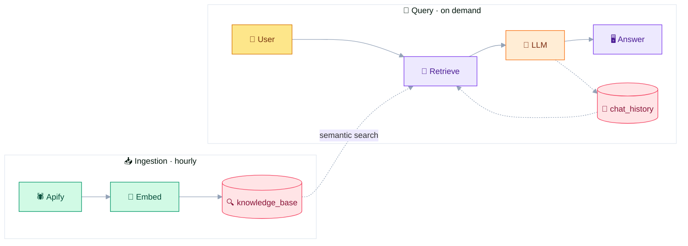
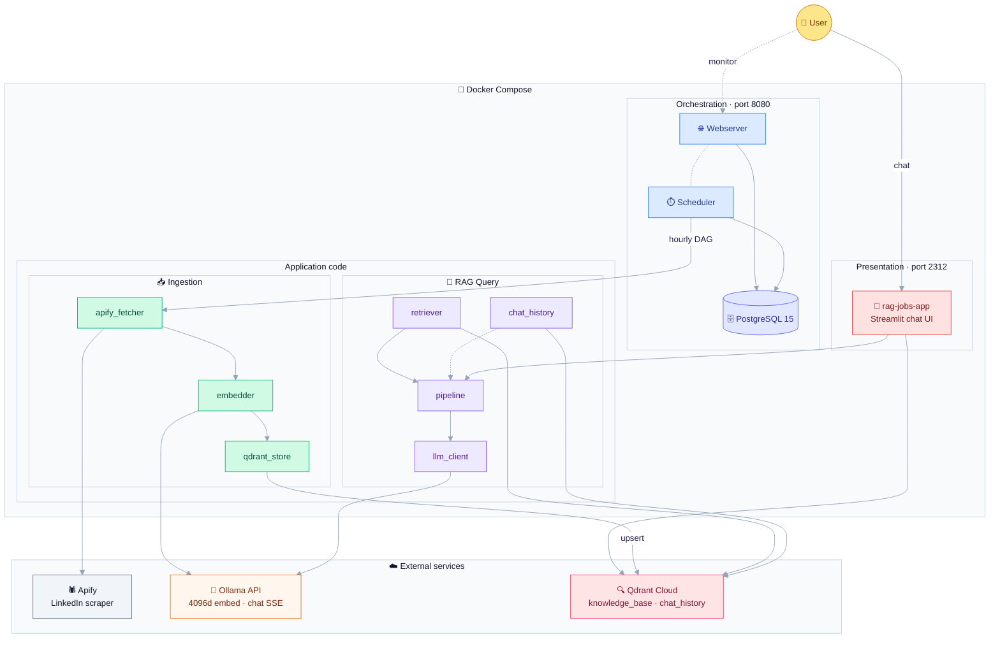
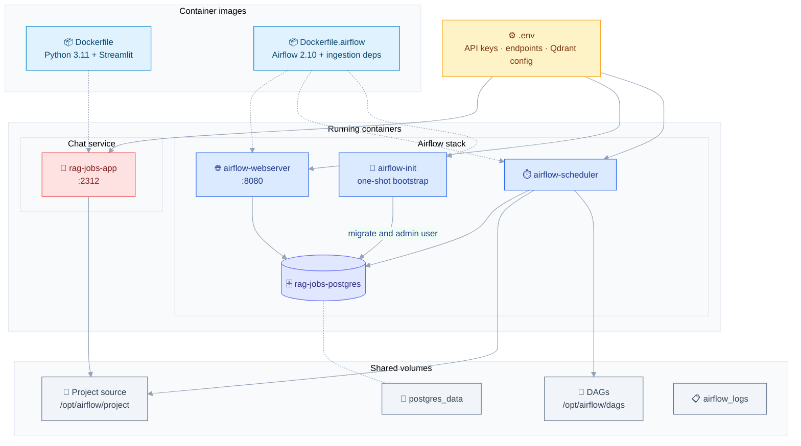
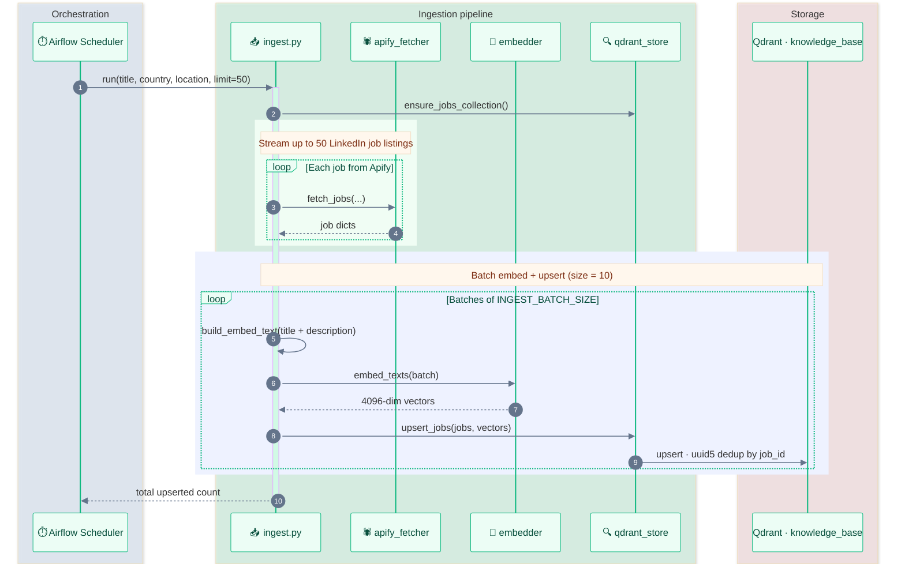

# JobRAG — AI-Powered Job Search Assistant

End-to-end **Retrieval-Augmented Generation (RAG)** pipeline for **Software Engineer** jobs in **Berlin, Germany**.

Automated hourly ingestion · Semantic vector search · Streaming LLM responses · Fully containerised.


---

## Table of Contents

- [Overview](#overview)
- [Architecture](#architecture)
- [Features](#features)
- [Tech Stack](#tech-stack)
- [Project Structure](#project-structure)
- [Prerequisites](#prerequisites)
- [Quick Start](#quick-start)
- [Configuration Reference](#configuration-reference)
- [How It Works](#how-it-works)
- [Airflow DAG](#airflow-dag)
- [Qdrant Collections](#qdrant-collections)
- [Command Reference](#command-reference)
- [Local Development](#local-development)
- [Design Decisions](#design-decisions)
- [Author](#author)

---

## Overview

JobRAG is a production-style RAG system that:

1. **Collects** Software Engineer job listings from LinkedIn Berlin every hour via [Apify](https://apify.com/hermann_samimi/real-time-jobs-api-linkedin-indeed-workday-glassdoor)
2. **Embeds** job descriptions into 4096-dimensional vectors and stores them in [Qdrant Cloud](https://cloud.qdrant.io)
3. **Answers** natural-language questions through a Streamlit chat UI, grounded in retrieved job listings

The system has two independent pipelines that share Qdrant and an OpenAI-compatible inference backend (typically [Ollama](https://ollama.com)):

| Pipeline | Trigger | Flow |
|---|---|---|
| **Ingestion** | Airflow `@hourly` | Apify → embed → `knowledge_base` |
| **Query** | User chat message | retrieve jobs + history → LLM stream → `chat_history` |



---

## Architecture

> **Animated flows:** Diagram edges use a moving dash animation. This renders in Cursor/VS Code preview, [Mermaid Live Editor](https://mermaid.live), and Mermaid 11+. GitHub’s built-in renderer may show static lines depending on its Mermaid version.

### System overview



### Deployment topology



---

## Features

| Feature | Detail |
|---|---|
| **Automated ingestion** | Airflow DAG runs every hour; fetches 50 fresh listings from LinkedIn Berlin |
| **Deduplication** | Deterministic point ID from `job_id` (`uuid5`) — re-ingesting the same job is a no-op |
| **Semantic search** | 4096-dim dense vectors, cosine similarity, top-5 retrieval |
| **Streaming responses** | Token-by-token output via SSE from the LLM API |
| **Conversation memory** | Per-session chat history in Qdrant, injected into every prompt |
| **Source transparency** | Each answer links back to the exact job listings used |
| **Fully containerised** | One `docker compose up` starts the entire stack |

---

## Tech Stack

| Layer | Technology | Purpose |
|---|---|---|
| **Orchestration** | Apache Airflow 2.10 | Hourly DAG scheduling, retries, monitoring |
| **Data source** | [Apify Actor `3HJWd9KfGyItAD5N9`](https://console.apify.com/actors/3HJWd9KfGyItAD5N9/source) | LinkedIn job scraping |
| **Vector database** | Qdrant Cloud | Job embeddings + chat history |
| **Embedding model** | `qwen3-embedding:8b` (4096d) via Ollama | Semantic representation of job text |
| **LLM** | `gemma3:27b` via Ollama | Grounded answer generation |
| **LLM API** | OpenAI-compatible REST endpoints | Shared interface for embed + chat |
| **UI** | Streamlit | Conversational chat interface |
| **Metadata DB** | PostgreSQL 15 | Airflow internal state only |
| **Containerisation** | Docker + Docker Compose | Full-stack deployment |
| **Language** | Python 3.11 | Application + DAG code |

---

## Project Structure

```
rag-jobs/
├── app.py                      # Streamlit chat UI
├── config.py                   # Centralised env-based configuration
├── embedder.py                 # OpenAI-compatible embedding client
├── ingestion/
│   ├── apify_fetcher.py        # Fetch job listings from Apify
│   ├── ingest.py               # Pipeline: fetch → embed → store
│   └── qdrant_store.py         # Collection management + upsert
├── rag/
│   ├── pipeline.py             # Orchestrates retrieve → prompt → stream
│   ├── retriever.py            # Vector search against Qdrant
│   ├── llm_client.py           # Streaming chat completions (SSE)
│   └── chat_history.py         # Per-session memory in Qdrant
├── dags/
│   └── ingest_jobs_dag.py      # Airflow DAG — @hourly, Berlin
├── Dockerfile                  # Streamlit app image
├── Dockerfile.airflow          # Airflow + ingestion dependencies
├── docker-compose.yml          # Full stack definition
├── requirements.txt            # App dependencies
└── requirements-ingestion.txt  # Ingestion-only dependencies (Airflow image)
```

---

## Prerequisites

- [Docker Desktop](https://www.docker.com/products/docker-desktop/) installed and running
- [Apify](https://apify.com) account with API key
- [Qdrant Cloud](https://cloud.qdrant.io) cluster (free tier is sufficient)
- OpenAI-compatible inference backend with both endpoints available:
  - **Embeddings** — `qwen3-embedding:8b` (4096 dimensions)
  - **Completions** — `gemma3:27b` (streaming)

### Ollama setup (recommended)

```bash
# Pull models
ollama pull qwen3-embedding:8b
ollama pull gemma3:27b

# Start the server (default port 11434)
ollama serve
```

Use these endpoints in `.env`:

```env
LLM_EMBEDDINGS_ENDPOINT=http://host.docker.internal:11434/v1/embeddings
LLM_COMPLETIONS_ENDPOINT=http://host.docker.internal:11434/v1/chat/completions
LLM_API_KEY=ollama
```

> **Note:** `host.docker.internal` lets containers reach Ollama on the host machine. On Linux, add `extra_hosts: ["host.docker.internal:host-gateway"]` to the `app` and Airflow services in `docker-compose.yml` if needed.

---

## Quick Start

### 1. Clone the repository

```bash
git clone https://github.com/<your-username>/rag-jobs.git
cd rag-jobs
```

### 2. Configure environment variables

Create a `.env` file in the project root:

```env
# Apify
APIFY_API_KEY=your_apify_api_key

# LLM API (OpenAI-compatible — Ollama)
LLM_COMPLETIONS_ENDPOINT=http://host.docker.internal:11434/v1/chat/completions
LLM_EMBEDDINGS_ENDPOINT=http://host.docker.internal:11434/v1/embeddings
LLM_API_KEY=ollama
EMBEDDING_MODEL=qwen3-embedding:8b
COMPLETIONS_MODEL=gemma3:27b

# Qdrant Cloud
QDRANT_HOST=https://your-cluster.cloud.qdrant.io
QDRANT_API_KEY=your_qdrant_api_key
QDRANT_JOBS_COLLECTION_NAME=knowledge_base
QDRANT_JOBS_VECTOR_SIZE=4096
QDRANT_JOBS_DISTANCE=Cosine
QDRANT_CHAT_HISTORY_COLLECTION_NAME=chat_history
TENANT_FIELD=user_id
```

> **Important:** Set `QDRANT_JOBS_VECTOR_SIZE=4096` to match `qwen3-embedding:8b`. The code default is `512` if this variable is omitted.

### 3. Start the stack

```bash
docker compose up --build -d
```

First build takes ~3–5 minutes.

### 4. Verify all services are running

```bash
docker compose ps
```

Expected output:

```
NAME                          STATUS
rag-jobs-postgres             running (healthy)
rag-jobs-airflow-init         exited (0)        ← expected: runs once
rag-jobs-airflow-webserver    running
rag-jobs-airflow-scheduler    running
rag-jobs-app                  running
```

### 5. Trigger the first ingestion

The DAG runs automatically every hour. To populate the database immediately:

```bash
docker exec rag-jobs-airflow-scheduler \
  airflow dags trigger ingest_software_engineer_jobs_berlin
```

Monitor the run at [http://localhost:8080](http://localhost:8080) — login: `admin` / `admin`.

### 6. Start chatting

Open [http://localhost:2312](http://localhost:2312) once the DAG run completes successfully.

---

## Configuration Reference

All settings are loaded from environment variables via `config.py`.

| Variable | Default | Used by | Description |
|---|---|---|---|
| `APIFY_API_KEY` | — | Ingestion | Apify platform API key |
| `LLM_EMBEDDINGS_ENDPOINT` | — | `embedder.py` | OpenAI-compatible embeddings URL |
| `LLM_COMPLETIONS_ENDPOINT` | — | `llm_client.py` | OpenAI-compatible chat completions URL |
| `LLM_API_KEY` | — | LLM clients | Bearer token (use `ollama` for Ollama) |
| `EMBEDDING_MODEL` | `qwen3-embedding:8b` | `embedder.py` | Embedding model name |
| `COMPLETIONS_MODEL` | `gemma3:27b` | `llm_client.py` | Chat model name |
| `QDRANT_HOST` | `http://localhost:6333` | All Qdrant access | Qdrant cluster URL |
| `QDRANT_API_KEY` | — | All Qdrant access | Qdrant API key |
| `QDRANT_JOBS_COLLECTION_NAME` | `knowledge_base` | Jobs collection | Job listing collection |
| `QDRANT_JOBS_VECTOR_SIZE` | `512` | Collection setup | **Set to `4096` for qwen3-embedding** |
| `QDRANT_JOBS_DISTANCE` | `Cosine` | Collection setup | Vector distance metric |
| `QDRANT_CHAT_HISTORY_COLLECTION_NAME` | `chat_history` | Chat history | Conversation collection |
| `TENANT_FIELD` | `user_id` | Chat history | Payload field for user scoping |

Constants defined in code (not env-configurable):

| Constant | Value | Location |
|---|---|---|
| `TOP_K` | 5 | Jobs retrieved per query |
| `MAX_HISTORY_TURNS` | 10 | Conversation turns loaded into prompt |
| `INGEST_BATCH_SIZE` | 10 | Jobs embedded and upserted per batch |

---

## How It Works

### Ingestion pipeline



**Embedding text:** `title + description` when available; falls back to `title + company + location`.

### RAG query pipeline

```mermaid
---
config:
  theme: base
  themeVariables:
    fontFamily: ui-sans-serif, system-ui, sans-serif
    fontSize: 14px
    primaryColor: '#EDE9FE'
    primaryBorderColor: '#8B5CF6'
    primaryTextColor: '#4C1D95'
    secondaryColor: '#DBEAFE'
    secondaryBorderColor: '#3B82F6'
    tertiaryColor: '#FFEDD5'
    tertiaryBorderColor: '#F97316'
    lineColor: '#94A3B8'
    clusterBkg: '#FAFAFA'
    clusterBorder: '#E5E7EB'
  themeCSS: |
    @keyframes flow {
      to { stroke-dashoffset: -20; }
    }
    .edgePath path, .flowchart-link {
      stroke-width: 1px !important;
      stroke-dasharray: 6 4 !important;
      animation: flow 1s linear infinite !important;
    }
    .marker path, .arrowheadPath { stroke-width: 1px !important; fill: #94A3B8 !important; }
    .cluster rect { stroke-width: 1px !important; }
    .node rect, .node circle, .node ellipse, .node polygon { stroke-width: 1px !important; }
---
flowchart LR
    A(["👤 User message"])

    subgraph Retrieve["🔍 Retrieval"]
        direction TB
        B["🧬 Embed query<br/>qwen3-embedding:8b"]
        C["📚 Vector search<br/>top-5 · cosine"]
        B --> C
    end

    subgraph Memory["🧠 Memory"]
        D["💬 Load chat_history<br/>last 10 turns"]
    end

    subgraph Generate["✨ Generation"]
        direction TB
        E["📝 Prompt assembly<br/>system + history + jobs"]
        F["🌊 Stream answer<br/>gemma3:27b · SSE"]
        E --> F
    end

    subgraph Persist["💾 Persist"]
        direction TB
        G["Save user turn"]
        H["Save assistant turn"]
        G --> H
    end

    I(["🖥️ UI response<br/>answer + source cards"])

    A --> B
    A -.-> D
    C --> E
    D -.-> E
    F --> G
    H --> I

    Qdrant[("🔍 Qdrant Cloud")]
    Ollama["🦙 Ollama API"]

    C <--> Qdrant
    D <--> Qdrant
    B --> Ollama
    F --> Ollama
    G --> Qdrant
    H --> Qdrant

    classDef start fill:#FDE68A,stroke:#D97706,stroke-width:1px,color:#78350F
    classDef end fill:#FEE2E2,stroke:#EF4444,stroke-width:1px,color:#7F1D1D
    classDef retrieve fill:#EDE9FE,stroke:#8B5CF6,stroke-width:1px,color:#4C1D95
    classDef memory fill:#DBEAFE,stroke:#3B82F6,stroke-width:1px,color:#1E3A8A
    classDef generate fill:#FFEDD5,stroke:#F97316,stroke-width:1px,color:#7C2D12
    classDef persist fill:#D1FAE5,stroke:#10B981,stroke-width:1px,color:#064E3B
    classDef store fill:#FFE4E6,stroke:#F43F5E,stroke-width:1px,color:#881337
    classDef llm fill:#FEF3C7,stroke:#F59E0B,stroke-width:1px,color:#78350F

    class A start
    class I end
    class B,C retrieve
    class D memory
    class E,F generate
    class G,H persist
    class Qdrant store
    class Ollama llm
```

**Prompt assembly** (`rag/pipeline.py`):

1. System prompt with grounding rules
2. Last `MAX_HISTORY_TURNS × 2` messages from `chat_history`
3. User message augmented with formatted top-5 job listings (title, company, location, description snippet, URL)

---

## Airflow DAG

```mermaid
---
config:
  theme: base
  themeVariables:
    fontFamily: ui-sans-serif, system-ui, sans-serif
    fontSize: 14px
    primaryColor: '#DBEAFE'
    primaryBorderColor: '#2563EB'
    primaryTextColor: '#1E3A8A'
    lineColor: '#64748B'
  themeCSS: |
    @keyframes flow-state {
      to { stroke-dashoffset: -20; }
    }
    .transition {
      stroke-width: 1px !important;
      stroke-dasharray: 6 4 !important;
      animation: flow-state 1.2s linear infinite !important;
    }
    .state-start, .state-end circle { stroke-width: 1px !important; }
    .statediagram-state rect { stroke-width: 1px !important; }
    .note rect { stroke-width: 1px !important; }
---
stateDiagram-v2
    direction LR

    [*] --> Scheduled: hourly tick

    Scheduled --> Running: scheduler picks up
    Running --> Success: task complete
    Running --> Retry: transient failure
    Retry --> Running: wait 3 min, max 2 retries
    Running --> Failed: timeout or retries exhausted

    Success --> [*]
    Failed --> [*]

    note right of Running
        ingest_software_engineer_jobs_berlin
        50 jobs · Berlin · Software Engineer
    end note
```



| Property | Value |
|---|---|
| **DAG ID** | `ingest_software_engineer_jobs_berlin` |
| **Schedule** | `@hourly` |
| **Task** | `ingest__germany__berlin` |
| **Jobs per run** | 50 |
| **Retries** | 2 (3-minute delay) |
| **Timeout** | 20 minutes per task |

Each run fetches the 50 most recent Software Engineer listings in Berlin from LinkedIn via the [Apify Actor](https://console.apify.com/actors/3HJWd9KfGyItAD5N9/source), embeds them with `qwen3-embedding:8b`, and upserts into Qdrant. Re-ingesting the same `job_id` overwrites the existing point rather than creating a duplicate.

---

## Qdrant Collections

### `knowledge_base`

Stores vectorised Software Engineer job listings for Berlin.

| Field | Type | Notes |
|---|---|---|
| **vector** | 4096-dim float | Embedded from `title + description` |
| `title` | string | Job title |
| `company` | string | Hiring company |
| `location` | string | e.g. Berlin, Germany |
| `description` | string | Full job description (primary RAG source) |
| `job_url` | string | Direct link to the listing |
| `seniority_level` | keyword (indexed) | e.g. Entry level, Mid-Senior level |
| `employment_type` | keyword (indexed) | e.g. Full-time, Part-time |
| `is_remote` | keyword (indexed) | Remote flag when available |
| `country` | keyword (indexed) | e.g. germany |
| `site` | keyword (indexed) | Source site |
| `language` | keyword (indexed) | e.g. en |

### `chat_history`

Stores conversation turns per user session.

| Field | Type | Notes |
|---|---|---|
| **vector** | 4096-dim float | Embedded from message content |
| `user_id` | keyword (indexed) | Browser-scoped tenant ID |
| `session_id` | keyword (indexed) | Conversation scope |
| `role` | keyword (indexed) | `"user"` or `"assistant"` |
| `content` | string | Raw message text |
| `timestamp` | string | ISO 8601 — used for ordering |

---

## Command Reference

### Stack management

```bash
# Start all services (detached)
docker compose up --build -d

# Stop all services (data preserved)
docker compose down

# Stop and delete all data (clean slate)
docker compose down -v

# View logs
docker compose logs -f app
docker compose logs -f airflow-scheduler
```

### Airflow

```bash
# Trigger ingestion manually
docker exec rag-jobs-airflow-scheduler \
  airflow dags trigger ingest_software_engineer_jobs_berlin

# List recent DAG runs
docker exec rag-jobs-airflow-scheduler \
  airflow dags list-runs -d ingest_software_engineer_jobs_berlin

# Pause / resume scheduled runs
docker exec rag-jobs-airflow-scheduler \
  airflow dags pause ingest_software_engineer_jobs_berlin

docker exec rag-jobs-airflow-scheduler \
  airflow dags unpause ingest_software_engineer_jobs_berlin
```

### Rebuild after code changes

```bash
# App only
docker compose build app
docker compose up -d --no-deps app

# Airflow (after ingestion code changes)
docker compose build airflow-scheduler airflow-webserver
docker compose up -d --no-deps airflow-scheduler airflow-webserver
```

---

## Local Development

Run components outside Docker for faster iteration (requires `.env` configured and Ollama running):

```bash
# Install dependencies
pip install -r requirements.txt

# Run ingestion manually
python -m ingestion.ingest \
  --title "software engineer" \
  --country germany \
  --location berlin \
  --limit 50

# Start the Streamlit UI
streamlit run app.py --server.port 2312
```

The Streamlit app bootstraps both Qdrant collections on first load via `@st.cache_resource`.

---

## Design Decisions

**Why Qdrant Cloud?** Managed infrastructure — no storage configuration, backups, or scaling work. The free tier handles thousands of job embeddings comfortably.

**Why embed title + description?** The description is the richest signal for semantic matching. When descriptions are missing (common with LinkedIn scrapers), title + company + location still produce meaningful embeddings.

**Why Airflow over a cron job?** Airflow provides run history, retry logic, and a monitoring UI — important for a pipeline that depends on external APIs.

**Why store chat history in Qdrant?** Keeping all persistent vector state in one system simplifies deployment and operations.

**Why Ollama?** Local inference with `qwen3-embedding:8b` and `gemma3:27b` keeps costs predictable and data private. Any OpenAI-compatible provider works as a drop-in replacement.

**Why uuid5 deduplication?** Deterministic point IDs from `job_id` make hourly re-ingestion idempotent without a separate dedup lookup step.

---

## Author

**Hermann Samimi** — Senior Data Engineer

Portfolio project demonstrating end-to-end data engineering: pipeline orchestration, vector databases, LLM integration, and containerised deployment.

[](https://linkedin.com/in/your-profile)
[](https://github.com/your-username)
[](https://huggingface.co/HermannS11)
